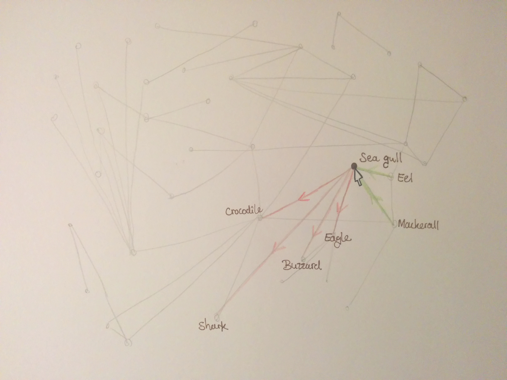
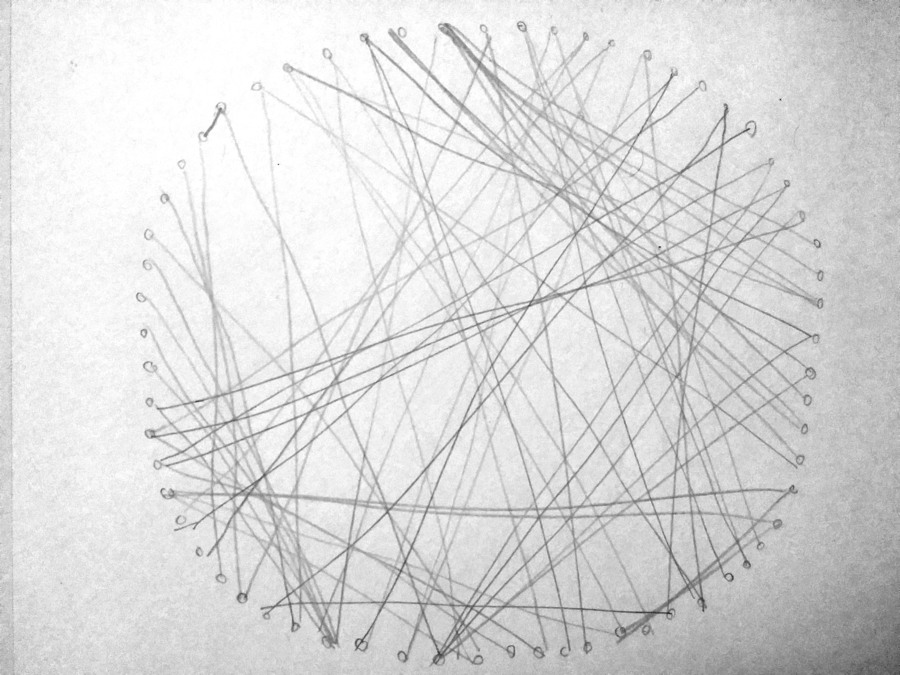
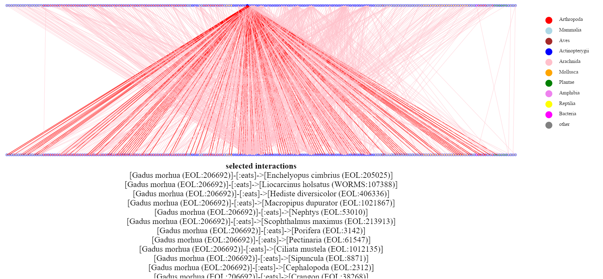
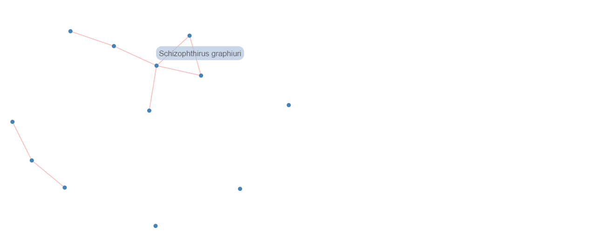
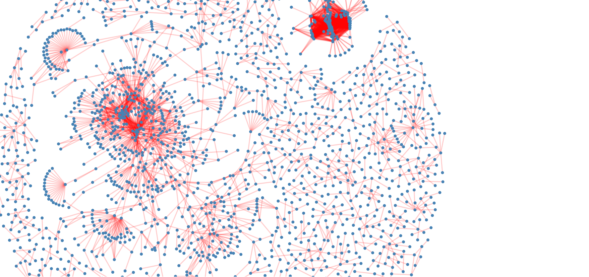
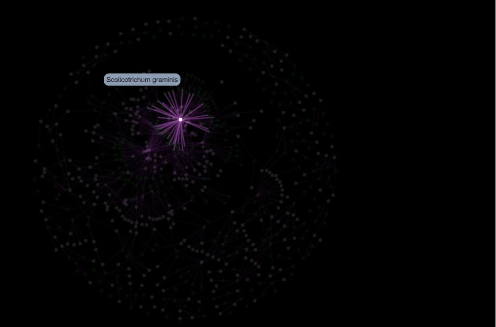
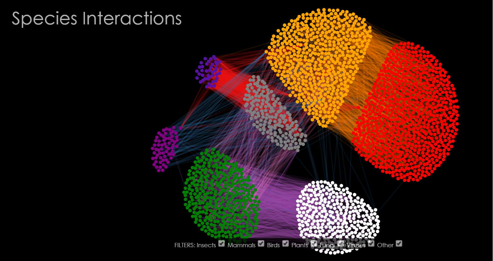
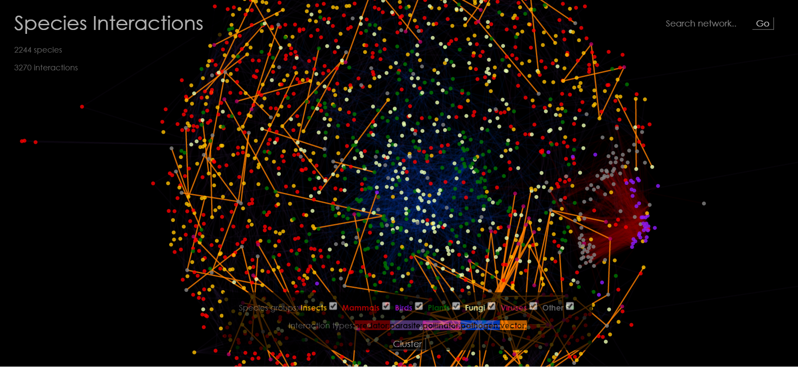

# Day 1
Finding a nice subject and an open source dataset to use for the project. The dataset I found is already used for a simple visualisation showing only the direct connections around one specific species. I feel that that is not a good representation of the dataset or what it stands for, namely that almost everything on earth is interconnected. Therefore I will aim to use the data to show exactly that and subsequently allow the user to select and zoom in on the data.

There are several visualisation types that can be used for this:
* [A bundle diagram](http://mbostock.github.io/d3/talk/20111116/bundle.html)
* [A chord diagram](http://sdk.gooddata.com/gooddata-js/example/chord-chart-to-analyze-sales/)
* [A network map](http://christophergandrud.github.io/networkD3/)
* [A sankey diagram](http://bost.ocks.org/mike/sankey/); note: here I'll need the biomass data per species group.. which might be a cool extra feature but not the main focus.

As the dataset contains data for many different species and many interactions; it may be wise to focus on a standard network map with filtering options such as habitat and the type of interactions.

# Day 2
Setting up folder structure and deciding what data is needed. Ideally, the user may be allowed to filter on the specific species, their (taxonomic) kingdom, their habitat or their interactions. That means that per species there should be a JSON object containing this information, however due to the size of the dataset it may be better to use the API.
Made some more sketches.

# Day 3
Fiddling with an example d3 source code from https://github.com/jhpoelen/eol-globi-js/blob/master/examples
but is very slow - possibly due to API as loading time changes when I change search query - so definitely going to make my own JSON file and minimise the size.

# Day 4
Decided to not use the JSON format provided by the [API](http://api.globalbioticinteractions.org/interaction?type=json.v2) as atom tends to crash. Instead I downloaded the CSV files for each 'active' interaction type; e.g. the interaction type "isParasiteOf" instead of "hasParasite" via the API like this: http://api.globalbioticinteractions.org/interaction?interactionType=isParasiteOf&type=csv. This halves the amount of data without actually losing interactions.

# Day 5
Mainly got stuck on creating the nodes and links in d3 and adding a force layout.

# Day 6
Found a probable explanation for my troubles with plotting the data in a network, namely dataset issues such as interactions (links) in which one of the species (source or target) has no id. Therefore I made a small test.json file to continue making a network visualisation, implementing a force layout and creating a tooltip.

# Day 7
Finally fixed the dataset! There was one tiny link that led to a node that wasn't there. Also added a tooltip to the edges/links.

# Day 8
Rendering is a bit slow due to the largeness of the dataset and the force simulation.

There are several options to make this less of a problem:

1. Set a maximum number of ticks for the force layout, thereby making the visualisation static

2. Making the visualisation move faster towards an equilibrium

3. Visualise the individual creation of the nodes and links; possibly on a given position

# Day 9
Restructured the interaction.js file to cope with filtering nodes and links. Added interactive element of double-click to highlight a species with its interactions. Also made a start with making a radial layout.

# Day 10
Fine-tuned the interactive highlight to also show the linked nodes, but spend most of my time figuring out how to create a working filtering system that updates the nodes and links in the graph according to selected checkboxes. Did not succeed yet. I did decide that I also want a legend and a small window with some details on the selected species; perhaps via eol.org as the dataset I'm using already works with their id codes.

# Day 11
Finally managed to create a clustered network grouping the plants with the plants, the mammals with the mammals etc. Also fixed an issue in the dataset (the word 'vector' was wrongly interpreted..) and made a start with a detail window.

# Day 12
Finally fixed the filters! Checking / unchecking the checkboxes now actually adds or removes a specific group of species. I also created a button to switch between the layouts and made a start with a search box. Panning and zoom was also implemented.

# Day 13
Managed to make a fully functional search-box with autocomplete using jQuery. Searching for a species highlights the corresponding nodes and neighbours just like clicking on a node does. Added the number of species and interactions shown and a legend, doubling as filter and as labels and centralised the colourscheme by using the d3 colour function for ordinal scales. As you can see below, these still need some adjusting for proper readability.

# Day 14
Adjusted many minor things like colour and highlights and added some nice functionalities, e.g. highlighting the interactions when hovering over the legend entry:

