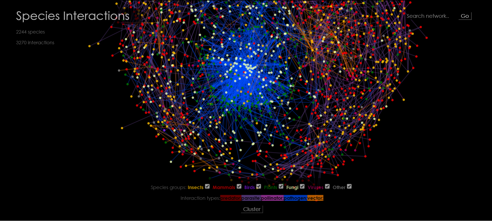
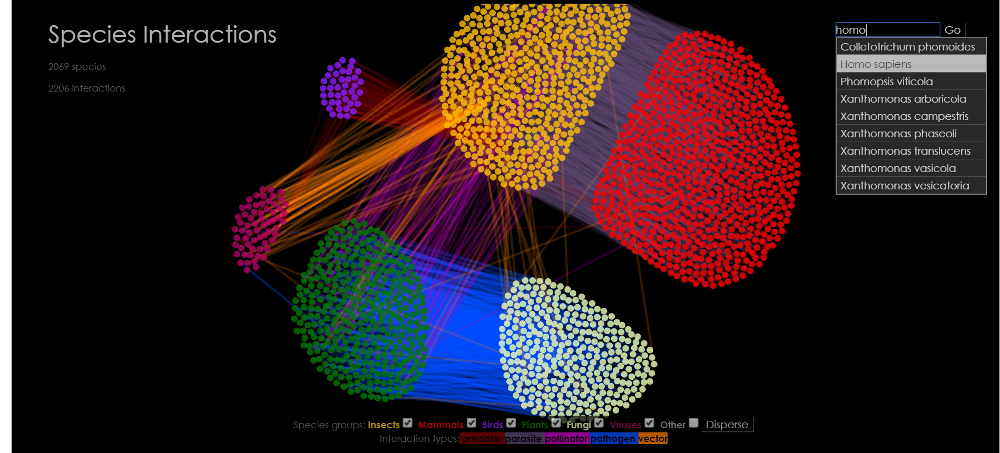
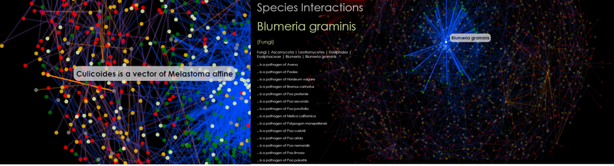
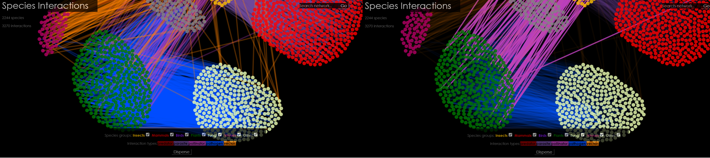

# Biotic Interactions
### A programming project by Anneke ter Schure
Part of the minor Programming of the University of Amsterdam

Who eats who? And how do these animals, plants, fungi or bacteria relate? This visualisation shines a light on different types of biotic interactions and consequently shows how everything and everyone on earth has a vital role.

#### Many small things make something big
Animals, plants, fungi and bacteria all over the world interact in different ways and over micro-scale to global distances. Many species specific research papers on these interactions have been published, but in order to get an overview of a system of interactions, or how an ecosystem functions, it is important to combine these results into a large dataset. The second part is the translation to something more visual: to convey this data in a comprehensible manner so that is becomes possible for us to see patterns in the data, gaps in knowledge, but more importantly to grasp how ecosystems function and that every species plays an important part.

#### Functionality
One big network creates the sense that the biotic interactions data is numerous and complex, but is is limiting in the sense that you still can't actually make sense of the data. Grouping species that are alike is one step towards this goal. Others are for instance: to pan and zoom, highlight interactions of a specific species, search for a species, filter out groups of species you're not interested in, highlight only certain interactions types, etc.

#### Data
The interaction data is downloaded from the [GloBI API](https://github.com/jhpoelen/eol-globi-data/wiki/API#interactions) and is a result of the [Global Biotic Interactions project](http://www.globalbioticinteractions.org). This dataset contains information about the interactions of species and what of what type they are; i.e. predatory or parasitic.

#### Sources
For information about making network visualisations in d3 the following sources were consulted:

1. [the D3 wiki ](https://github.com/mbostock/d3/wiki/Force-Layout)

2. Mike Bostock's code for a [force-directed graph](http://bl.ocks.org/mbostock/4062045), [multi-foci force layout](http://bl.ocks.org/mbostock/1021841) and [zooming behaviour](http://bl.ocks.org/mbostock/6123708).

3. Stackoverflow for a [method to use names instead of indices](http://stackoverflow.com/questions/23986466/d3-force-layout-linking-nodes-by-name-instead-of-index) for creating the links.

Licenses of sources:
The used data from the [GloBI API](https://github.com/jhpoelen/eol-globi-data/wiki/API#interactions) are under the [Creative Commons Attribution-NonCommercial 4.0 International License](http://creativecommons.org/licenses/by-nc/4.0/). Sharing and adapting is free as long as long as the appropriate credit is given.
Stackoverflow questions and answers are under the [Creative Commons Attribution Share Alike license](https://creativecommons.org/licenses/by-sa/3.0/) meaning that it's free to share and adapt, but under the restriction that it is made clear what the source is and that the project is under a similar license.
Mike Bostock's code is free to redistribute and use, under the condition that [the copyright notice, the list of conditions and the disclaimer is reproduced](https://github.com/mbostock/d3/blob/master/LICENSE).

#### License
This project is licensed under the terms of the [MIT license](LICENSE.md).
Copyright (c) 2016 Anneke Th.M. ter Schure.
