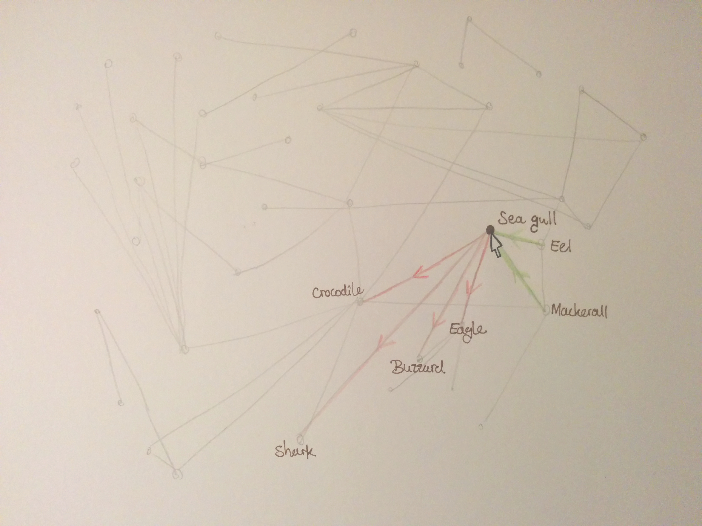

# reimagined-lamp
### A programming project by Anneke ter Schure

Who eats who? And how do these animals, plants, fungi or bacteria relate? This visualisation will shine a light on different types of biotic interactions and consequently show how everything and everyone on earth has a vital role.

#### Background
Animals, plants, fungi and bacteria all over the world interact in different ways and over micro-scale to global distances. Many species specific research papers on these interactions have been published, but in order to get an overview of a system of interactions, or how an ecosystem functions, it is important to combine these results into a large dataset. This has been done within the Global Biotic Interactions (GloBI) project and for ease of access they actually developed an infrastructure to search through the references, the available species data and location of where the data was obtained. However, due to the size of the dataset and the manner in which the data is conveyed it is impossible to grasp how an ecosystem functions. Only small sections of the interaction map can be seen at a time and searching for a specific species only provides you with limited information and taxonomic names that are incomprehensible for the average person. The overview is lacking and thereby the essential realisation that everything and everyone on this earth is connected and depending on everything and everyone.

#### Potential problems
As stated before, the Global Biotic Interactions (GloBI) project already convey the data visually. However, only small sections of an interaction map can be seen at a time and these are always localised around one specific species of which generally only the taxonomic name is given. Also the windows are too small to see the complete visualisations. One thing I do really like is their flow chart on the [bottom right panel](http://www.globalbioticinteractions.org/browse/index.html#interactionType=interactsWith&resultType=json&sourceTaxon=Chelonia%20mydas) that shows all interactions of one specific species with others, which are grouped according to their taxa, but similar interactions are also bundled together so patterns can be seen. Unfortunately, sometimes the amount of interactions visualised is so big that it become difficult to distinguish the different species. A bigger bundle diagram ([like this one](http://mbostock.github.io/d3/talk/20111116/bundle.html)) might be a solution or even a chord diagram. For the latter option there might be a problem that related species have very different eating habits or other interactions and you lose this insight. A better options seems to be a more chaotic network that is visually still clear due to colour use, such as https://cooperatoby.files.wordpress.com/2012/10/linked-in-map.jpg or https://flowingdata.com/2012/08/02/how-to-make-an-interactive-network-visualization/.
One of the major problems is that there is too much data for a clear visualisation. Potential methods to resolve this are to only show a selection of the data, allow filtering of the data and allow rearrangement of the data, e.g. by grouping all bird species together or all species that live underground.

#### Data
As previously stated, there is already a dataset with information about the interactions of species and what of what type they are; i.e. predatory, parasitic or mutualistic. This will be the basis for the visualisations. This API that allows for direct usage of the data in a JSON format. However, I would like to create a static JSON file for practical reasons. This will be done by downloading the data from github.com/jhpoelen/eol-globi-data/ and perhaps adjusting it in python to fit the needs of the visualisation. Also some basic information about the species is needed, including the common names, and may be added to the JSON file at this stage. Again, this data can be also obtained directly from a specific webpage.

Potential data sources are the following:
* [iNaturalist](http://www.inaturalist.org)
* [GloBI](https://www.globalbioticinteractions.org)
* [Wikipedia](http://www.wikipedia.org)
* [Encyclopedia of Life](https://www.eol.org)

The interaction data is downloaded from the [GloBI API](https://github.com/jhpoelen/eol-globi-data/wiki/API#interactions). Only data from the 'active' interaction types are used; e.g. the interaction type "eats" and not "getsEatenBy", and "isParasiteOf" and not "hasParasite". This halves the amount of data without actually losing interactions.

#### Proposed visualisation
The visualisation will be on a webpage. The first thing you should see will be a big network map showing the overwhelming amount of interactions that take place between all species. Hovering over the lines (representing the interaction) or the dots (representing species) should highlight these and the immediately linked species and interactions.

Filters will be available to view only a selection of species and interactions, e.g. using a search box to look for specific species, a drop-down list and checkboxes to search for certain types of interactions.
Clicking on a species will update a small section of the webpage showing some basic information about the species such as its taxonomy and specific habits.
A second page will show a similar visualisation to the first one but now focused on the loss of a species. Clicking a dot (representing a species) will recolor the lines and dots to show the effect of the loss on other species, discriminating between positive and negative effects. Also a counter on top of the visualisation will show the number of species directly affected and the number of species indirectly affected.

#### Sources
For information about making network visualisations in d3 I consulted:

1. [the D3 wiki ](https://github.com/mbostock/d3/wiki/Force-Layout)

2. Mike Bostock's code for a [force-directed graph](http://bl.ocks.org/mbostock/4062045)

3. Stackoverflow for a [method to use names instead of indices](http://stackoverflow.com/questions/23986466/d3-force-layout-linking-nodes-by-name-instead-of-index) for creating the links

4. ...
