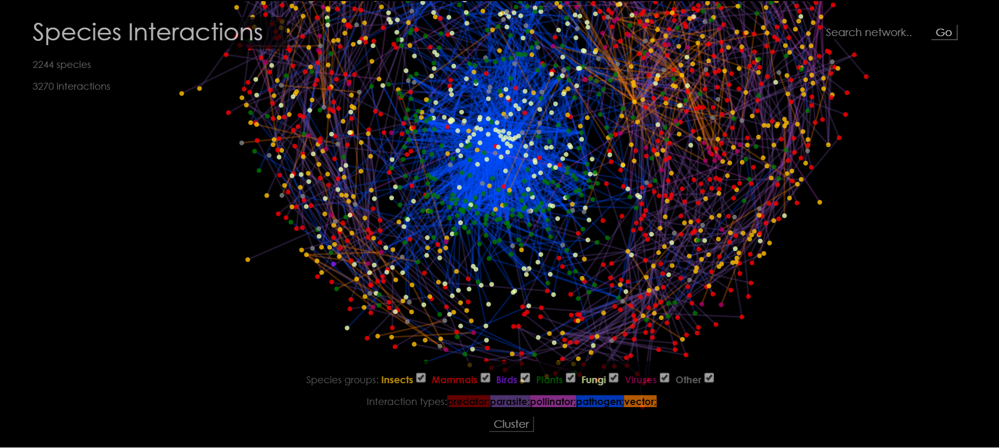
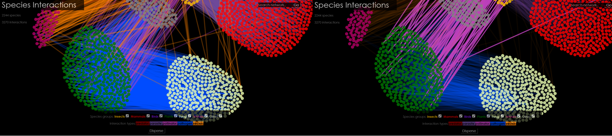

# Biotic Interactions
### A programming project by Anneke ter Schure

Who eats who? And how do these animals, plants, fungi or bacteria relate? This visualisation shines a light on different types of biotic interactions and consequently shows how everything and everyone on earth has a vital role.

#### First some background
Many species specific research papers on species interactions have been published, but in order to get an overview of a system of interactions, or how an ecosystem functions, it is important to combine these results into a large dataset. Apart from this professional argument aimed at knowledge acquisition based on obtained data, there is also the practicality of finding out what is already known and where the gaps in knowledge are.
The gathering of scientific findings on biotic interactions has been done within the [Global Biotic Interactions project](http://www.globalbioticinteractions.org). However, due to the size of this dataset and the manner in which the data is conveyed it is impossible to grasp the bigger picture of how an ecosystem functions. The overview is lacking and thereby the essential realisation that everything and everyone on this earth is connected and dependent on each other.

#### Species interactions made interactive
The Biotic Interactions visualisation shows a complex network where nodes represent species and links represent the type of interaction between the species. Hovering over these nodes and links shows a tooltip with the species name or the nature of the interaction. Clicking on a node highlights all interactions of that particular species and provides the user with information about these interactions.
As stated by Albert Cairo in his book The Functional Art, visualisations are a tool that should allow comparisons and make correlations evident (Cairo, 2014). This particular visualisation does this for instance by grouping the nodes based on taxonomy (in this case mostly the taxonomic kingdoms, e.g. plants, and classes, e.g. mammals), highlighting only a certain type of interaction when hovering over that particular legend entry and allowing the user to choose which species groups to explore.

#### Technical design
The architecture of the visualisation is quite simple as it only consists of 5 files (exluding the used libraries).
* [BioticInteractions/index.html](index.html) is a basic HTML5-file with links towards the required libraries (D3 and jQuery) and towards:
* [BioticInteractions/Styles/styles.css](BioticInteractions/Styles/styles.css) i.e. the stylesheet in CSS3;
* [BioticInteractions/Scripts/interactions.js](BioticInteractions/Scripts/interactions.js) containing the bulk of the code in JavaScript and imports the data from:
* [BioticInteractions/Data/bioInteractions.json](BioticInteractions/Data/bioInteractions.json) which is a JSON file made by:
* [BioticInteractions/Data/makedatafile.py](BioticInteractions/Data/makedatafile.py), a Python 2.7.10 file requiring the [AllInteractions.csv](BioticInteractions/Data/AllInteractions.csv) file retrieved from globalbioticinteractions.org;

The latter of the described files is not used when a user interactions with the visualisation as the user dialog is just the webpage encoded in the index.html file. The bulk of the code for the style of the webpage is in the aptly named styles.css. The Document Object Model (in index.html) is adjusted by the code in the interactions.js file, which creates the visualisation based on the data in bioInteractions.json using the D3 library created by Mike Bostock. I decided to use D3 because of the great functionalities when it comes to visualising large datasets and specifically for the force-layout it encodes for networks.

The interaction data is downloaded from the [GloBI API](https://github.com/jhpoelen/eol-globi-data/wiki/API#interactions) and is a result of the [Global Biotic Interactions project](http://www.globalbioticinteractions.org). This dataset contains information about the interactions of species and what of what type they are; i.e. predatory or parasitic.

For information about making network visualisations in d3 the following sources were consulted:
1. [the D3 wiki ](https://github.com/mbostock/d3/wiki/Force-Layout)
2. Mike Bostock's code for a [force-directed graph](http://bl.ocks.org/mbostock/4062045), [multi-foci force layout](http://bl.ocks.org/mbostock/1021841) and [zooming behaviour](http://bl.ocks.org/mbostock/6123708).
3. Stackoverflow for a [method to use names instead of indices](http://stackoverflow.com/questions/23986466/d3-force-layout-linking-nodes-by-name-instead-of-index) for creating the links.

#### Design process
The aim of the visualisation is to show how complex a network of species interactions is and thereby how complex an ecosystem is. A secondary aim is to provide a tool to explore these interactions and facilitate pattern finding. These aims have not really changed compared to the beginning of this project. However, some design choices to achieve these aims have.
One major issue was that the dataset is quite big, too big in fact to create a network that allows for a clear overview of the data. On the one hand this was good as it is concurrent with my first aim. On the other hand, in order for the second aim to also be achieved I had some work to do. There were several designs that I liked (e.g. a [bundle](http://mbostock.github.io/d3/talk/20111116/bundle.html) or [chord diagram](http://sdk.gooddata.com/gooddata-js/example/chord-chart-to-analyze-sales/)), but I decided to first focus on a less structured network map. As can be read in the [design document](DESIGN.md) that I've written in the first week, I decided that the user must at least be able to select and filter the data and that the species names should appear on hovering over the nodes. However, just making a network map proved to be more troublesome than I anticipated due to some minor problems in the dataset only found by checking each object in the datafile e.g. interactions that missed a source or a target.
After the network map worked as planned, I started adding things like colours and legends, but still with the idea of a cluster layout in my head. So I started working on that, but somewhere along the way I realised that there were over 2000 species in the dataset so in order to create a radial layout I would have to create several circles. If you include the links this would still be chaotic. Therefor I decided to stick with the force-layout as an initial state of the network and create a second layout that groups the species together based on their taxonomy thereby allowing for proper pattern finding.
The rest of my time was spent on fixing bugs and adding more functions to achieve the second aim of providing a tool to explore the species interactions and facilitate pattern finding. These are: zooming, panning, showing details about a species' interactions, searching specific species (including an autocomplete function), highlighting all interactions of a certain type and a counter of the number of species and the number of interactions currently shown in the visualisation. Thereby eventually making a much more intricate visualisation than first meets the eye.

First view of the Biotic Interactions network

Selecting a node shows direct interactions

Highlighting specific interaction types shows patters that otherwise seem absent

#### References
Cairo, A. (2012). The Functional Art: An introduction to information graphics and visualization. New Riders.
